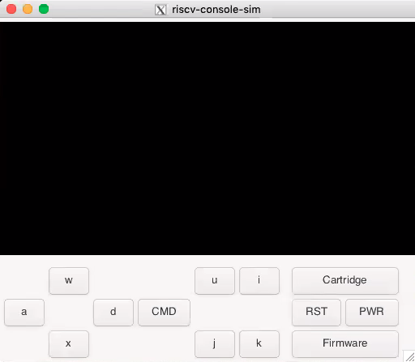
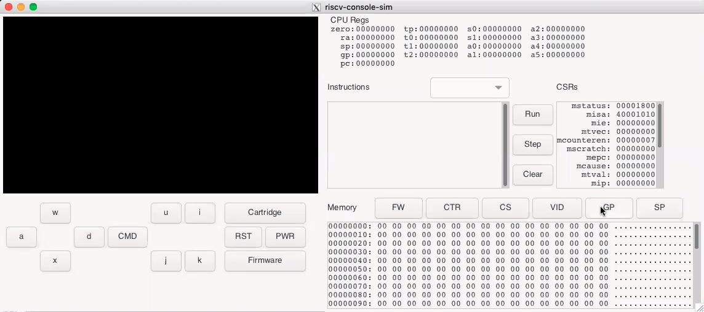

# Pong Game

To showcase the strengths of our operating system, we have implemented the classic game, Pong, as our app. In this game, two players control paddles to bounce a ball back and forth. 

## Reference Documents

* [Simulator Documentation](docs/simulator.md)
* [Hardware Documentation](docs/hardware.md)
* [Autorunner Documentation](docs/autorunner.md)
* [Troubleshooting](docs/troubleshooting.md)

## Features
- **Clear Entry Instructions:** Upon starting, players receive concise instructions about controls and the time limit, ensuring an even playing field for all.
- **Multi-button controller support:** Our multi-button controller support allows for two-player gameplay. The CMD button also serves to pause the game.
- **Game timer:** The game timer adds an exciting element, challenging players to outdo each other in shorter timeframes.
- **Pause Functionality (Video interrupt):** Using the OS's video interrupt feature, the game can be paused and resumed seamlessly, enhancing the intensity of play.
- **Engaging Graphics:** Our physics engine brings the game to life with responsive paddles and a ball that reacts realistically upon impacts. The pause icon and changing background further enrich the visual experience.

## Game Control and Rules
In our Pong game, players aim to block the ball with their paddles and score against the opponent. One player can control their paddle using the 'w' and 'x' keys of the multi-button controller, while the other player uses the 'u' and 'k' keys for control. The ball's speed increases with each hit, adding to the challenge. The physical simulation engine varies the ball's speed based on the hit location on the paddle, mimicking real-world physics. The CMD button on the controller is used for pausing and resuming the game. A timer adds urgency to the gameplay, with a visual cue when it reaches halfway. When the timer counts down to zero, the game will be ended.

## Getting Started
The simulation environment and toolchain have been setup to run within a Docker container. The directions assume that you have git, Docker, X-11 support and a bash shell on your machine. If you are running on Windows and wish to use PowerShell follow the directions [here](docs/powershell.md). 

If you have the following problem
```
xhost:  unable to open display "/private/tmp/com.apple.launchd.hvM8yt00vq/org.xquartz:0"
```
try running this command
```
xhost +localhost
```

### Launch Docker Container
Once the repository has been cloned, change directories into the riscv-console and run the console launch script with the command:
```
./rvconsole.sh
```
The script will pull the base RISC-V Docker image `cjnitta/riscv_base` that has the RISC-V build tool chain. This will take some time as the image is several GB in size. This should only have to be done once. Once the base image has been pulled the RISC-V development environment Docker image `riscv_console_dev` will be built. The second image builds upon the base and should build quickly. Once the image is built the script will launch a container name `riscv_console_run`. This will mount the current riscv-console directory into the `/code` directory of the container allowing for source files to be edited on the host machine as well as within the container. Once the container is launched you should see a prompt like:
```
root@fedcba9876543210:/code#
```

### Verify RISC-V Tools
The next step is to build the RISC-V example program to test on the simulator. Change directory into `/code/riscv-example` and then run `make`. This should build an example that will put `Hello World!` on the simulator screen and have an `X` that will move based upon the controller direction buttons. 

### Compile the Firmware and Cartridge
The firmware is located in `/code/firmware` folder. You can compile it with
```
make clean && make
```

**Note:** If you are running ported versions, you don't have to compile. The compiled file is already included. 

The cartridge is located in `/code/cartridge` folder. You can compile it with
```
make clean && make
```

### Launch Simulator
You can launch the simulator with the full path using the command:
```
/code/runsim.sh
```
This should build the simulator if it hasn't been built yet and will launch the simulator using X11 assuming everything is installed properly. The script will launch the simulator under the docker user instead of root. This may be necessary for Linux clients. You should see the simulator window that looks like: 



You can now select the example program by hitting the Firmware button and navigating to the `/code/riscv-example/bin` directory. Either the `riscv-console-example`, or `riscv-console-example.strip` file can be loaded. Once the PWR button can be pushed and the `Hello World!` message with an X should appear on the screen. Pressing the direction buttons on the simulator or the associated keys should move the `X` in the particular direction. The simulated CPU can be shut down by hitting the PWR button again. This should dump the status of the registers and memory so may take a while. Once the simulated CPU is shutdown the PWR button will no longer be highlighted. The simulator can be closed by hitting the appropriate close button for the window.

The simulator can also be run in debug mode by adding the `-d` option to the `riscv-console-sim` program or even to the `runsim.sh` script. You should see the simulator window that looks like following in debug mode: 



The `Run` button will run the system until it is clicked again, or until a breakpoint is hit. The `Step` button will execute a single instruction, and the `Clear` button will clear all breakpoints. Breakpoints can be toggled by double clicking the associated instruction. The `FW`, `CTR`, `CS`, and `VID` buttons will jump to the Firmware, Cartridge, Chipset, and Video Memory base addresses. The `GP` and `SP` buttons jump to the memory specified by the `gp` and `sp` registers.
